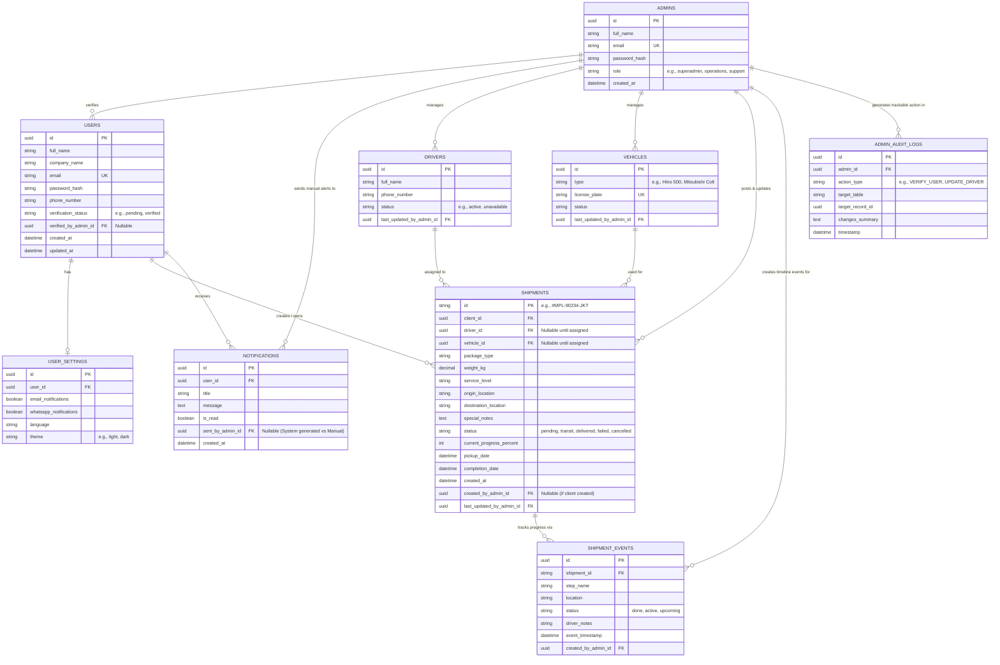

# MPL System Database ERD (Client & Admin)

Based on the existing client dashboard and the planned Admin CRM, here is the modernized Relational Database Schema. The Admin CRM will serve as the master controller, capable of mutating all records.

### Table Breakdown

1. **`ADMINS`**: The central controllers of the CRM. Contains role-based access control (e.g., superadmin vs support).
2. **`ADMIN_AUDIT_LOGS`**: A crucial tracking table. Since admins can change anything in the CRM, this table records *who* changed *what* and *when* (e.g., "Admin B updated the status of Driver X").
3. **`USERS`**: The client accounts. Admins interact with this table to approve/verify pending client registrations via the `verified_by_admin_id` tracker.
4. **`DRIVERS` & `VEHICLES`**: Core operational logistics data explicitly managed and updated by administrators inside the CRM.
5. **`SHIPMENTS` & `SHIPMENT_EVENTS`**: Tracks operational freight data. Admins can both post new shipments (acting on behalf of clients) or create distinct linear `SHIPMENT_EVENTS` (like assigning a package to the "Customs" status).
6. **`NOTIFICATIONS`**: Aside from system-generated alerts, an admin ID is linked here for times when operations staff push manual alerts/messages to a client's dashboard.
